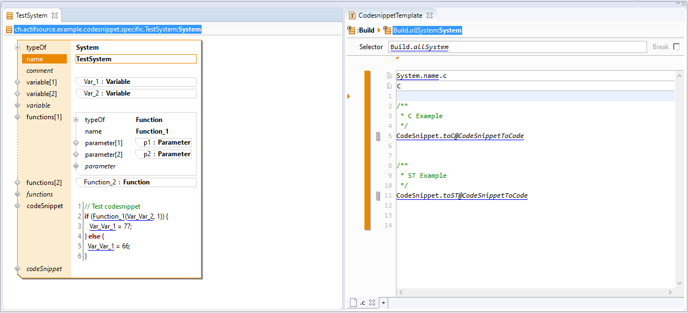
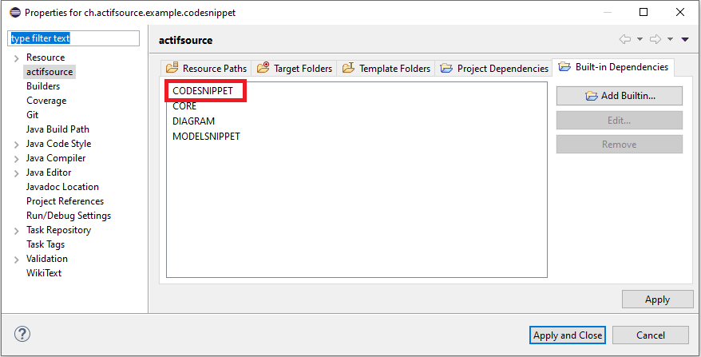

# Codesnippet Model
In this project we will show how to set up the codesnippet model.  
Show actifsource user manual [Code Snippet](https://www.actifsource.com/_downloads/ActifsourceManual_ActifsourceUserManual.pdf).

## Model Snippet Built-In
Define the model snippet built-in

## Requirements
Actifsource Workbench Enterprise Edition

## License
[http://www.actifsource.com/company/license](http://www.actifsource.com/company/license)
